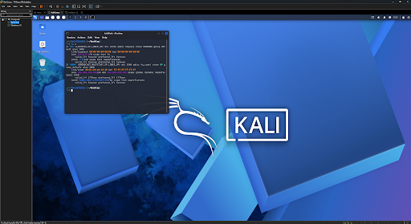
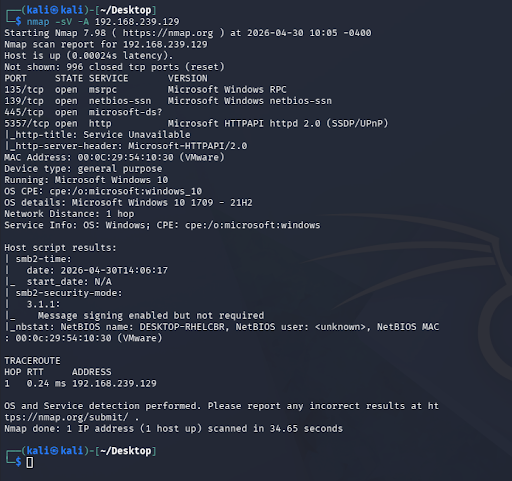
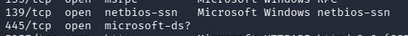

# Network Scanning Lab

## Overview
Built a virtual lab environment using Kali Linux and Windows to simulate a small network and perform network reconnaissance.

## Lab Setup
- Kali Linux attacker machine
- Windows 10 target machine
- Configured within VMware on a host-only network



---

## Nmap Scan Results

Performed a full TCP scan using Nmap to identify open ports and running services.

### Command Used
```bash
nmap -sV -A 192.168.239.129
```
- -sV detects service versions
- -A enables OS detection, version detection, and script scanning



---

## Key Findings

- Open ports identified: 135 (MSRPC), 139 (NetBIOS), 445 (SMB), 5357 (HTTP)
- SMB (port 445) exposed, representing a common attack vector for lateral movement and exploitation in Windows environments
- NetBIOS and RPC services indicate typical Windows network behaviour
- Demonstrates how misconfiguration can increase attack surface



---

## Security Insights

- Exposed SMB services can be targeted for unauthorised access or lateral movement
- Network reconnaissance is often the first stage of an attack
- Proper firewall configuration significantly reduces visibility of services

---

## Tools Used
- Nmap
- Kali Linux
- Windows 10
- VMware Workstation Pro
