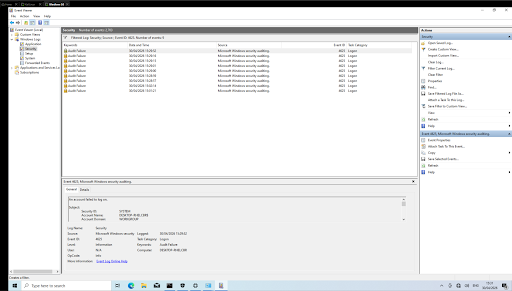
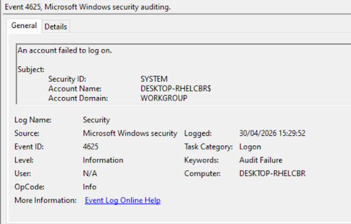

# SOC Log Analysis – Failed Login Detection

## Overview
Built a simple SOC-style lab to analyse Windows security logs and detect suspicious authentication activity. The aim was to identify patterns in failed login attempts and understand how brute force behaviour can be detected through log analysis.

---

## Lab Setup
- Windows 10 virtual machine
- Event Viewer used to analyse Security logs
- Audit policies enabled to capture logon events

---

## Log Analysis

Filtered Windows Security logs to identify failed login attempts using Event ID 4625.

### Key Event Details
- Event ID: 4625 (Failed logon)
- Log source: Microsoft Windows Security Auditing
- Multiple failed login attempts observed within a short time period

---

## Event Investigation

A single event was analysed in detail to understand the context of the failed login attempts.

Key information identified:
- Target account name
- Failure reason (e.g. incorrect password)
- Timestamp of each attempt
- Logon type and source information

---

## Key Findings

- Repeated failed login attempts detected over a short timeframe  
- Consistent targeting of a specific account suggests brute force behaviour  
- Logs provide sufficient detail to identify attack patterns and timing  
- Demonstrates how authentication logs can be used for threat detection  

---

## Security Insights

- Repeated failed logins are a common indicator of brute force attacks  
- Monitoring Event ID 4625 is essential for early detection of suspicious activity  
- Account lockout policies can help mitigate repeated login attempts  
- Log analysis is a core function within Security Operations Centres (SOC)  

---

## Tools Used
- Windows Event Viewer  
- Windows 10  
- VMware  
